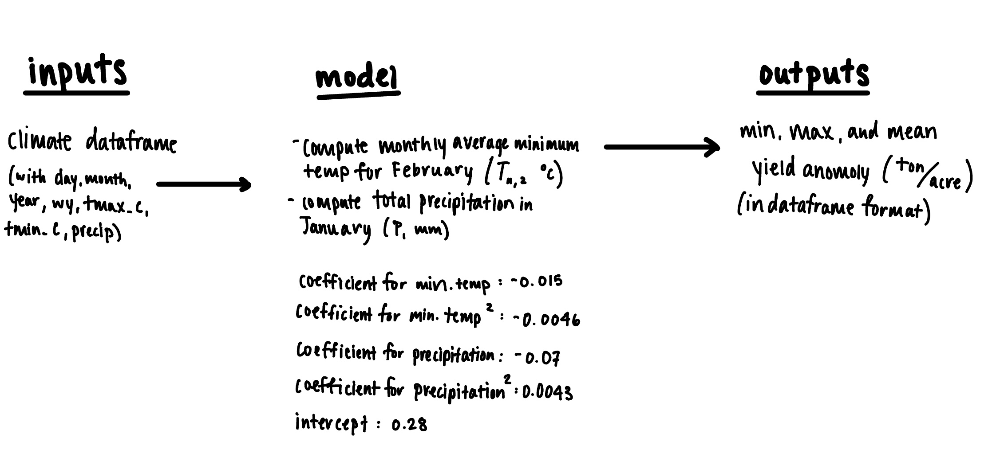

```{r setup, include=FALSE}
knitr::opts_chunk$set(echo = TRUE)
```

```{r, warning=FALSE, message=FALSE}
#| quiet: TRUE
# Load in 
library(tidyverse)
library(here)
```

```{r, warning=FALSE, message=FALSE}
#| quiet: TRUE
# Read in data
clim <- read_delim(here('data', 'clim.txt'))
```

```{r, warning=FALSE, message=FALSE}
# Source the function
source(here('yield.R'))

# Pass in dataframe
result <- almond_model(clim)

# Print results in a table 
kableExtra::kable(result)
```

```{r, warning=FALSE, message=FALSE}
# Diagram

```

```{r}
source(here('profit.R'))

profit_results <- profit(clim)
```

```{r}
yield_anomaly <- almond_model(clim)
  
  # year_yield_anomaly <- yield_anomaly$anomaly[yield_anomaly$wy == wy]
  
  yield_anomaly <- yield_anomaly %>% 
    mutate(profit = (2700 * yield_anomaly$anomaly) - 4500)
```
